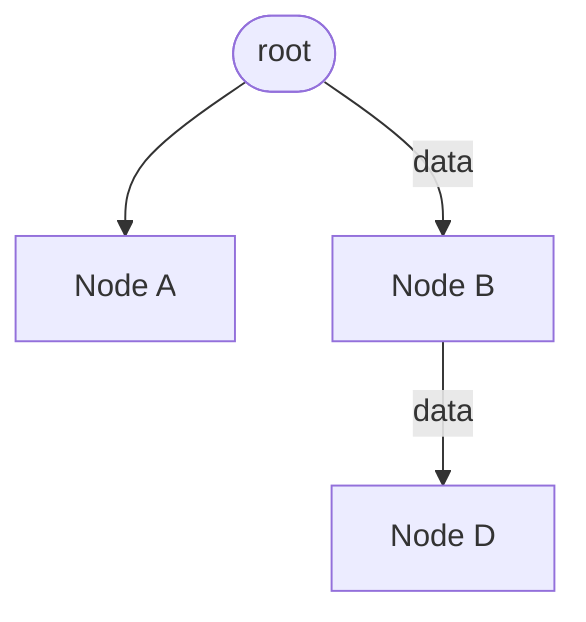

# React Props
{: .no_toc}

## Definition
{: .no_toc}

React Props or properties are the arguments or information use to communicate between the component.
Primarily props allows a parent component to send data to its child components.
In JSX props resembles HTML attributes.

Props are immutable, they are the readonly variable. this insures unidirectional data flow.

Change in props causes Child component to be rerender.

**Example :-**

```js
function ParentComponent() {
    // Passing props to child component
    return <ChildComponent name="Yogesh" age="26" />
}
// Accept props form parent
function ChildComponent(props) {
    const { age } = props;
    return <>
        Hi {props.name},
        Age - {age}
    </>
}
```

## props.children

this is the special type of props which is used when component do not know about the children's ahead of time.

```jsx

const ExampleChild = (props) => {
  return <header>{props.children}</header>
}
const ExampleParent = () => {
  return <ExampleChild>Hello Child</ExampleChild>
}
```

---

## Prop drilling

refers to the process of passing data from a parent component down to nested child components through props.
This situation occurs when a prop needs to be passed through several layers of nested components to reach a deeply nested child component that actually needs the prop.

**Example :-** 

