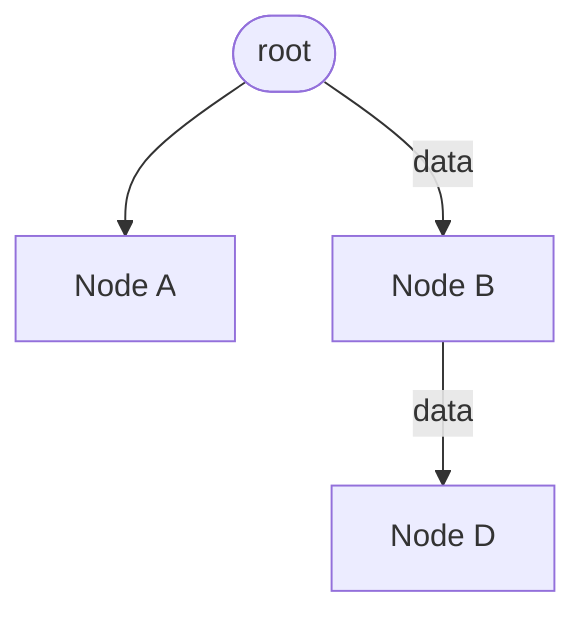

## Table of Contents
{: .no_toc .text-delta }

1. TOC
{:toc}


# React Props
<!-- {: .no_toc} -->

## Definition
{: .no_toc}

Props in react are properties passed from parent to child a component to customize its behavior and appearance.
They are read-only meaning the receiving component cannot modify them, ensuring unidirectional data flow from parent to children.

We can consider props as an argument passed to the function. they look similar to setting HTML tag attribute.
In JSX props resembles HTML attributes.

Props are immutable, they are the readonly variable. this insures unidirectional data flow.

Change in props causes Child component to be rerender.

In a JSX the pros are passed as a HTML Attribute and can be used using props keyword in child component
**Example :-**

```js
function ParentComponent() {
    // Passing props to child component
    return <ChildComponent name="Yogesh" age="26" />
}
// Accept props form parent
function ChildComponent(props) {
    const { age } = props;
    return <>
        Hi {props.name},
        Age - {age}
    </>
}
```

## props.children

this is the special type of props which is used when component do not know about the children's ahead of time.

```jsx

const ExampleChild = (props) => {
  return <header>{props.children}</header>
}
const ExampleParent = () => {
  return <ExampleChild>Hello Child</ExampleChild>
}
```

---

## Prop drilling

refers to the process of passing data from a parent component down to nested child components through props.
This situation occurs when a prop needs to be passed through several layers of nested components to reach a deeply nested child component that actually needs the prop.

**Example :-** 



# React States
<!-- {: .no_toc} -->

## Definition
{: .no_toc}


State in react is a built-in Component level object that is use to store and manage data change over time.

It is used to manage dynamic information such as user inputs, api response and UI state.

When state changes, React automatically re-renders the component to reflect the updated data.

In class component the state can be accessed with `this.state` and to update we can se `this.setState` function.

## Key Characteristics
- Local and Private: State is specific to a component instance and cannot be directly modified by parent components.
- Mutability: Unlike props, which are read-only, state is mutable and updated via specific methods.
- Automatic Updates: Changes to state trigger the reconciliation algorithm, ensuring only necessary parts of the DOM are updated.

**Example :-**

```js
import React, { useState } from 'react';
function ExampleComponent () {
    const [count, setCount] = useState(0);
    return(
        <>
            <p>Count is {count}</p>
            <button onClick={()=>setCount(pre => pre + 1)}>Increase</button>
        </>
    )
}
```

## Difference between props and states

| Props | States |
|:-----|:------:|
|